# flutter_application_1

My First App 

### Praktikum 4 running aplikasi
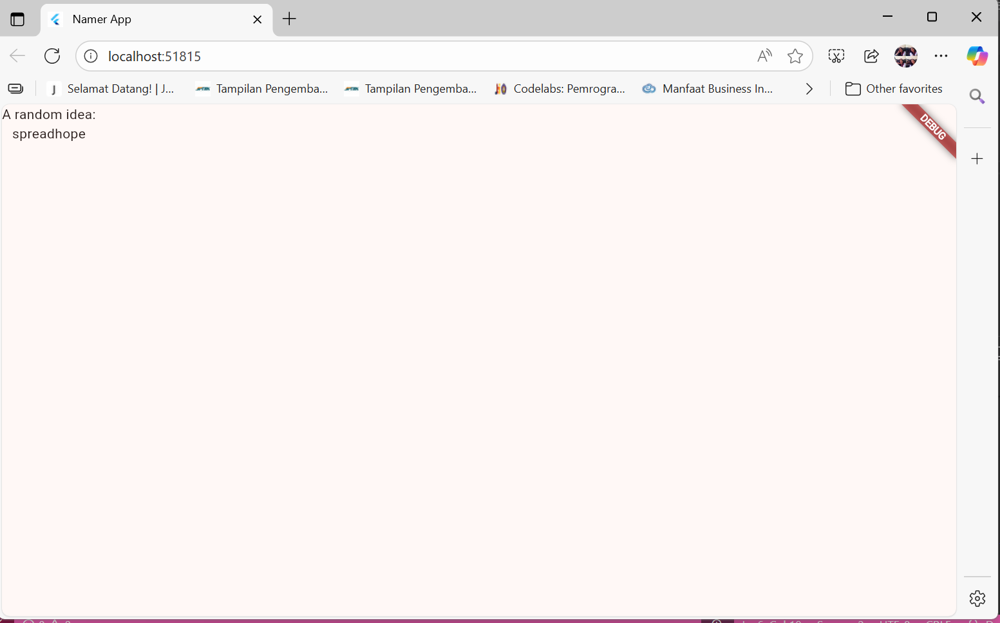

#### menambahkan tombol
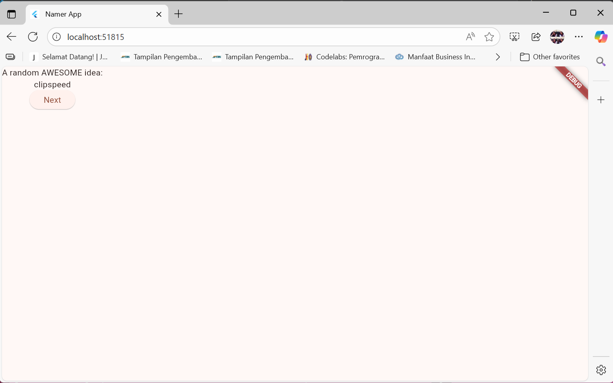

#### menambahkan tombol

### Praktikum 5 memperindah tampilan aplikasi
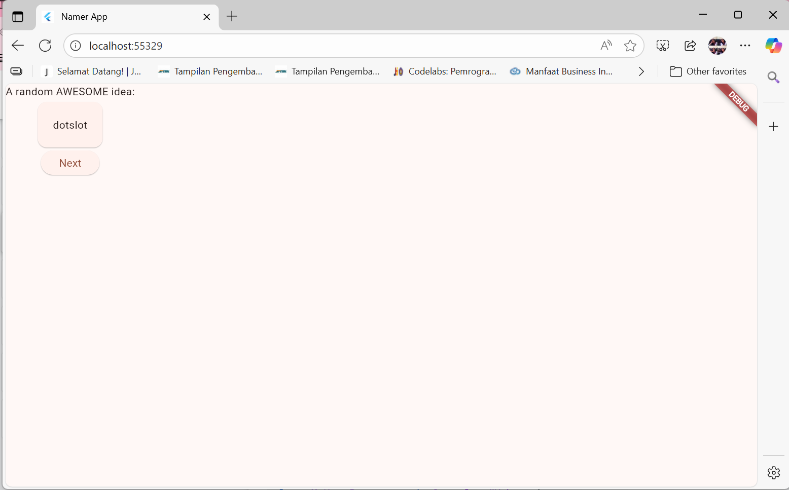

#### menambahkan card, tema dan style
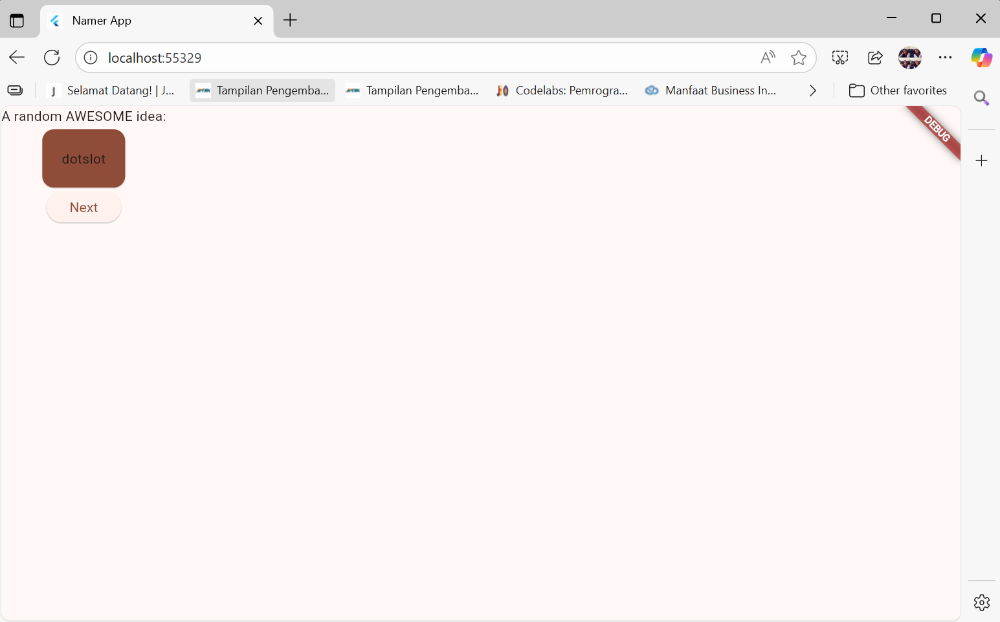

#### menambahkan textTheme
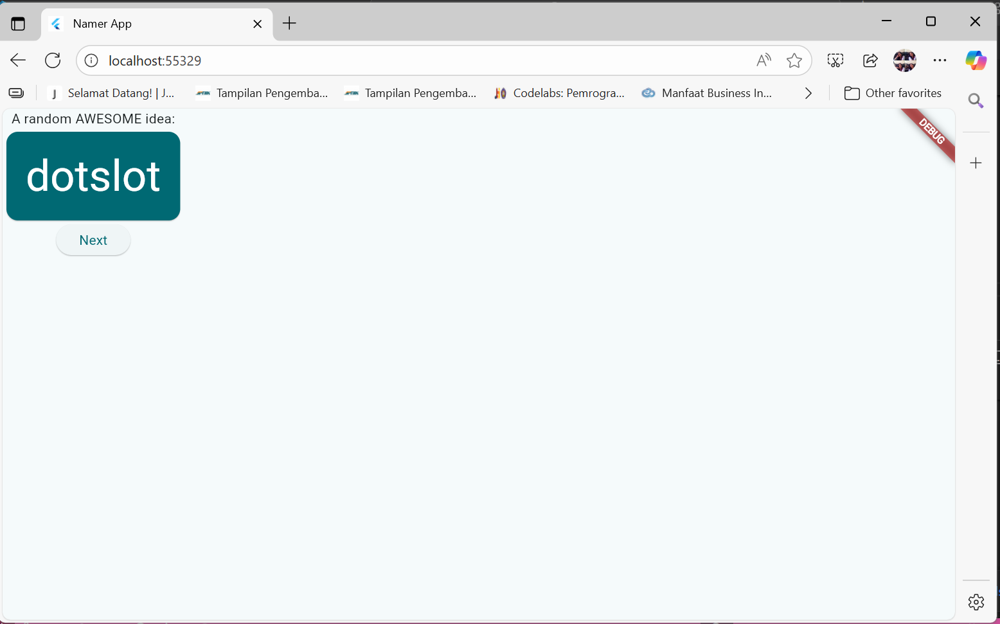

#### menambahkan textTheme center
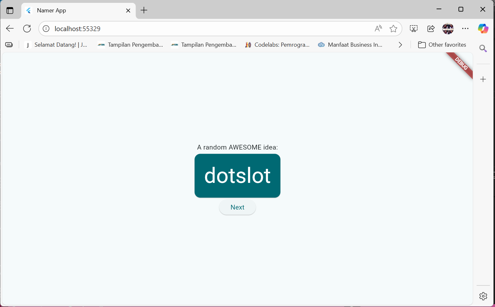

#### modifikasi BigCard
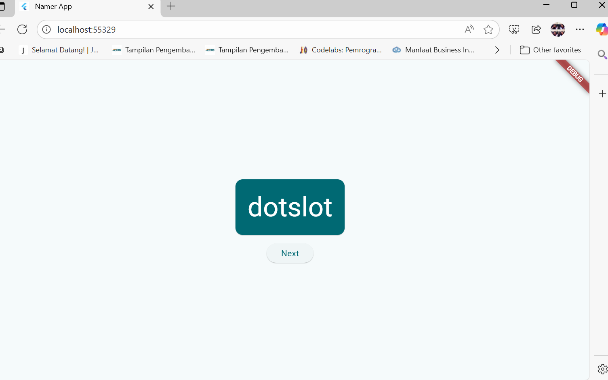

### Praktikum 6 menambahkan fungsi
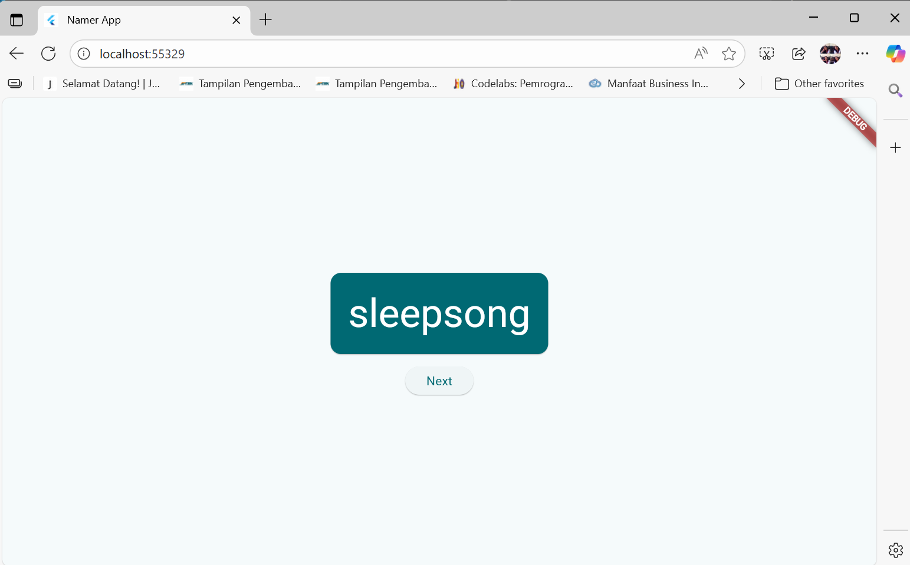

#### menambahkan fungsi untuk menampilkan tombol suka 
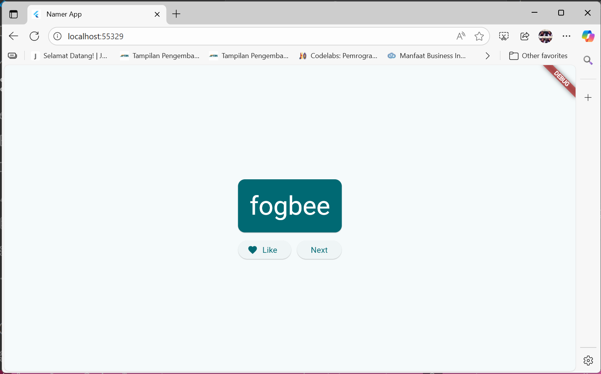

### Praktikum 7 menambahkan kolom disamping navigasi
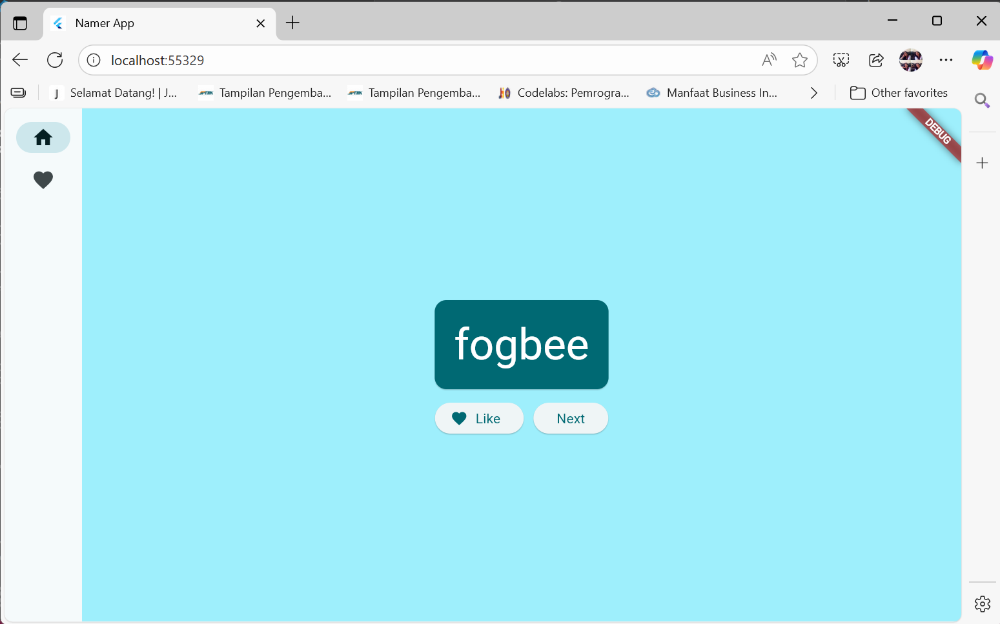

#### implementasi set index
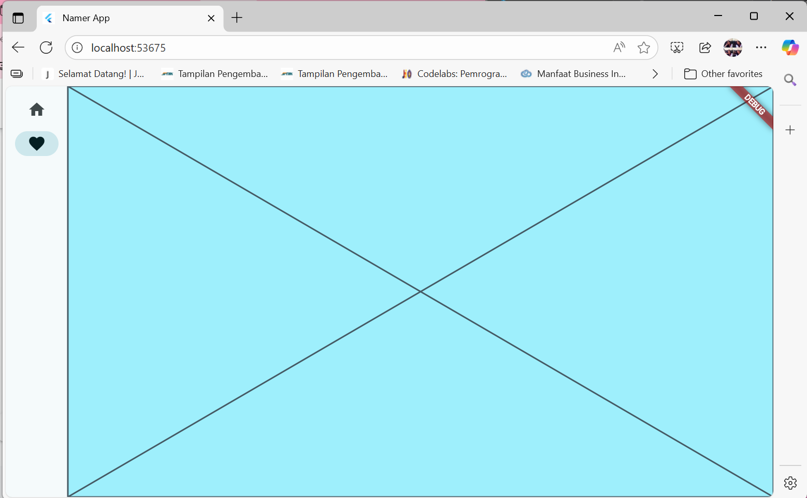

#### implementasi responsive page
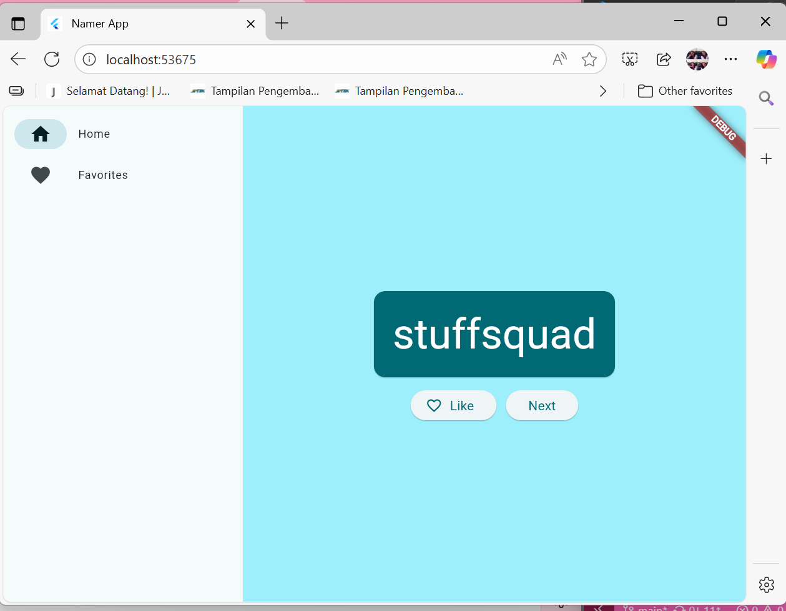

### Praktikum 8 implementasi penambahan halaman baru
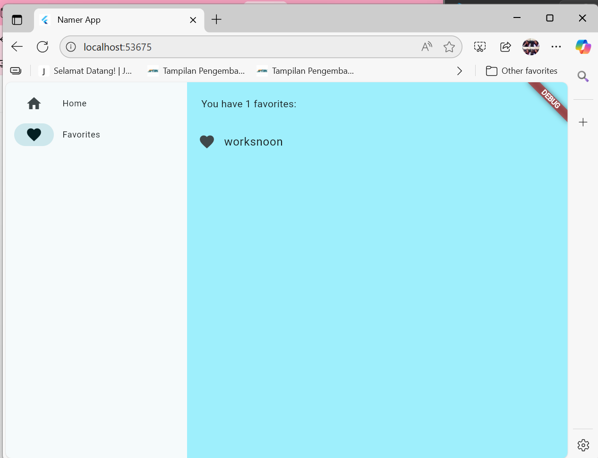